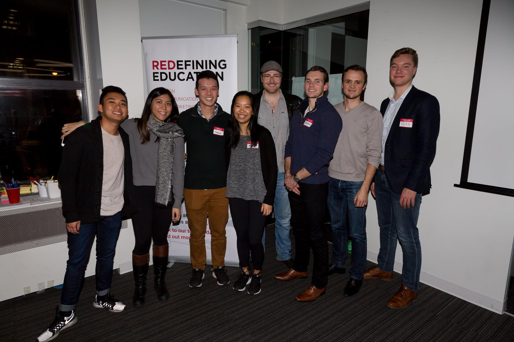

# MovemberBot

Website above links to a blog post about the event

Top 3 teams picture:

Movember Bot is a prototype of a Facebook Messenger chatbot that was designed to facilitate discussions about male mental health. This project won third place at Mo'Hacks 2017.

Mo'Hacks was a design based Hackathon (Hosted by ProtoHack & Movember) that took place over the course of twelve hours. Participants were asked to conceive an idea, build a visual prototype, and pitch the idea to a panel

Attendees were taught "The Design Mindset." Topics followed the process of product ideation to prototyping to creating a business plan. Industry prototyping tools included, such as Invision, were taught, and the process of design, rather than "just feeling it," was emphasized.
